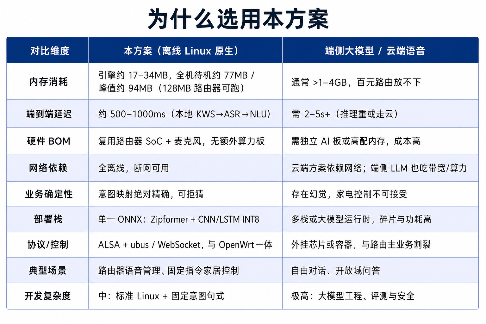
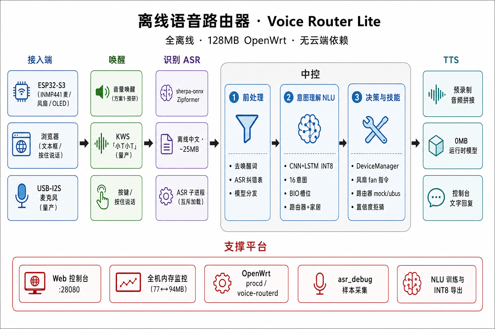

# 01 · 方案总览

> 目标设备：128MB MIPS 路由器（可用内存约 50MB）  
> 更新日期：2026-07-24  
> 相关：[02-演示脚本](./02-演示脚本.md) · [03-部署手册](./03-部署手册.md) · [05-模型与数据采集](./05-模型与数据采集.md)

---

## 一、目标与约束

在**不影响路由器网络吞吐**的前提下，实现精准、低延迟的**全离线**语音控制。

| 约束 | 要求 |
|------|------|
| 内存 | 峰值引擎可控，量产待机 / 峰值有硬线（见下文） |
| 确定性 | 家电/路由指令映射，不可接受 LLM 幻觉 |
| 离线 | 无云 API；预研期 ESP32 仅经局域网传 PCM |
| 成本 | 复用路由器 SoC + 廉价 DDR，避免外挂 AI 板 |

---

## 二、架构选型：为什么是 Linux 原生



| 评估维度 | 方案 A：外挂 MCU | 方案 B：Linux 原生（✅） | 方案 C：端侧大模型 |
|----------|------------------|-------------------------|-------------------|
| 系统架构 | 独立芯片 + 裸机/RTOS | 主 SoC + Linux Daemon | AI 算力板 + 容器 |
| 内存 | <1MB 高价 SRAM | **10–50MB 廉价 DDR** | >1–4GB |
| 硬件 BOM | +独立语音芯片 | **+麦克风阵列** | +边缘计算主板 |
| 交互能力 | 固定命令词 | **数百词条 + 状态机** | 自然语言 |
| 端到端延迟 | <300ms | **500–1000ms** | 2–5s+ |
| 业务确定性 | 绝对精确 | **绝对精确** | 幻觉风险 |
| 开发门槛 | 高 | **中** | 极高 |

**选中 B：** 复用 DDR、标准 Linux（ALSA / ubus）、cgroups 保网络优先。  
**放弃 A：** SoC 与 DDR 已在板，外挂语音芯片重复建设，UART 同步/OTA 成本高。  
**放弃 C：** 内存与功耗超出百元路由器；指令场景不需要生成式模型。

> MIPS 单核算力有限：ASR 可能占 50–80% CPU。应对：VAD + cgroups；推荐硬件基线 256MB 双核。

---

## 三、系统架构与数据流



### 预研（当前演示）

```
浏览器（localhost）                ESP32-S3（INMP441）
  ├─ 文本框 / 下拉 ──→ NLU          └─ 持续 PCM WebSocket
  └─ 按住说话（可选）──→ ASR→NLU              │
         │                                    ▼
         └──────────────→ Mac Web 服务 ← 音量唤醒 → 单次采集 → ASR → NLU
                              │
                              ├─ 路由器意图 → mock ubus（展示 NLU）
                              └─ 风扇意图   → WebSocket fan → ESP32 GPIO
```

ESP32 链路为**方案 1**：服务端音量触发 → 单次 utterance → ASR → NLU。演示双轨见 [02-演示脚本](./02-演示脚本.md)。

### 量产（路由器 Daemon）

```
USB-I2S 麦克风 → ALSA → voice-routerd
  ├─ 待机: KWS + NLU(INT8) 常驻
  ├─ 唤醒: 卸 KWS → ASR 子进程（可 C++ worker）→ 退出回收
  └─ ubus → 网络 / 系统 / GPIO
```

| 策略 | 作用 |
|------|------|
| 模型互斥 | KWS / ASR 不同时驻留 |
| ASR 子进程 | 识别结束内核回收内存 |
| Native worker | 可选，峰值再降约 20MB+ |
| INT8 NLU | ~3MB 替代 ~11MB |
| 双进程 | Web 与 daemon 独立启停 |

---

## 四、内存与性能预算

### 分阶段（128MB，优化后估算）

| 阶段 | 加载组件 | 内存占用 |
|------|----------|----------|
| 待机 | 系统 + KWS + NLU(INT8) + Buf | **~77MB** |
| 峰值（Python ASR） | + ASR 子进程 | **~94MB** |
| 峰值（C++ ASR） | + 原生 worker | **~70MB** |
| 识别后 | ASR 退出 | **~77MB** |

| 项目 | 磁盘 / 运行时 |
|------|----------------|
| 系统（OpenWrt + Python） | ~60MB |
| ASR zh 14M mobile | ~24MB / 子进程 ~25MB |
| KWS | ~5MB / ~8MB |
| NLU INT8 | ~3MB / ~4MB |
| 音频缓冲 | ~5MB |

必须使用 **zh 14M mobile** ASR，勿用 bilingual 大包。量产硬线目标（待实机填实测）：待机 ≤75MB，峰值 ≤88MB，ASR 后 ≤76MB。

控制台「全机内存」由状态机 / 真机 RSS 每 2 秒刷新，详见 [03-部署手册](./03-部署手册.md)。

### 关键取舍

| 决策 | 原因 |
|------|------|
| 预录制 TTS，不跑实时合成 | 省 ~30MB+ |
| 量产保留 KWS | USB 麦体验优于纯音量触发 |
| ESP32 预研用音量唤醒 | 远场麦 + 演示稳定性 |
| 字符级 CNN+LSTM | 体积远小于 Transformer |

---

## 五、技术栈一览

| 层级 | 预研（Mac Web） | 量产（OpenWrt） |
|------|-----------------|-----------------|
| 入口 | `python3 -m voice_router_lite web` | `python3 -m voice_router_lite router` |
| 麦克风 | ESP32 PCM / 浏览器按住说话 | USB-I2S + ALSA |
| 唤醒 | ESP32：音量；浏览器：按住 | KWS「小T小T」 |
| ASR | sherpa-onnx Zipformer ~25MB | 同左，子进程按需 |
| NLU | CNN+LSTM INT8 ~3MB | 同左 |
| 反馈 | 预录 WAV / 网页女声 | 预录 WAV |
| 控制 | ESP32 fan；路由 mock | ubus + GPIO |

### 与「Paraformer + FastText」对比（摘要）

| 点 | 本方案 | 对方常见形态 |
|----|--------|--------------|
| ASR | Zipformer 可 MIPS 交叉编译 | Paraformer 体积大且 MIPS 难兼容 |
| NLU | 意图 + BIO 槽位一步到位 | FastText 仅分类 + 规则黑洞 |
| 部署 | 单一 ONNX Runtime | 多推理栈叠加 |

训练与意图表见 [05-模型与数据采集](./05-模型与数据采集.md)。

---

## 六、硬件连接概要

**预研：** Mac/路由器跑引擎；ESP32-S3 只采音与执行（INMP441、风扇、数码管等）。模型**不**在 ESP32。  
**量产：** 路由器 USB-I2S 直连麦；ESP32 可选仅作家居执行端。

接线、烧录、FAQ → [04-开发与硬件手册](./04-开发与硬件手册.md)。

---

## 七、实施路线与风险

| 阶段 | 状态 |
|------|------|
| Mac Web + ESP32 联调 | ✅ |
| NLU 训练与 INT8 | ✅ |
| ASR/KWS 集成（Daemon 路径） | ✅ |
| ESP32 方案 1 + 控制台双轨 | ✅ |
| 路由器朗读纠错（Mac） | ✅ |
| MIPS 交叉编译 + ubus + cgroup | ⬜ |
| 72h 稳定性 | ⬜ |

| 风险 | 应对 |
|------|------|
| 内存不足 | INT8；极端纯规则兜底 |
| MIPS 兼容 | QEMU 先行；备选 256MB 双核 |
| ESP32 麦 ASR 差 | 风扇关键词兜底；路由意图走文本/浏览器麦 |
| 浏览器麦限制 | 仅 localhost + Chrome/Safari |

---

## 八、相关文档

- [02-演示脚本](./02-演示脚本.md)
- [03-部署手册](./03-部署手册.md)
- [04-开发与硬件手册](./04-开发与硬件手册.md)
- [05-模型与数据采集](./05-模型与数据采集.md)
- [06-优化基线](./06-优化基线.md)
- 归档原文：[archive/离线语音方案-路由器部署.md](./archive/离线语音方案-路由器部署.md)
